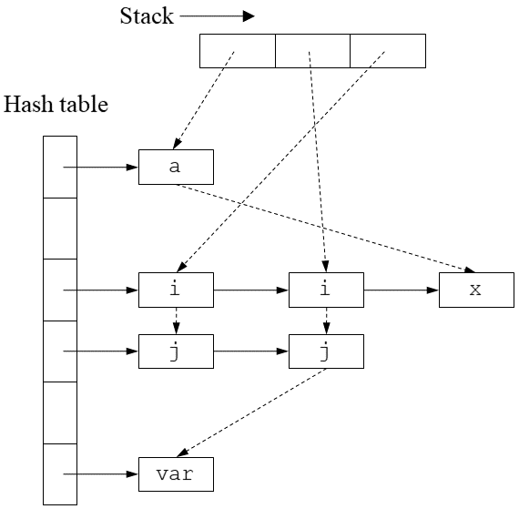
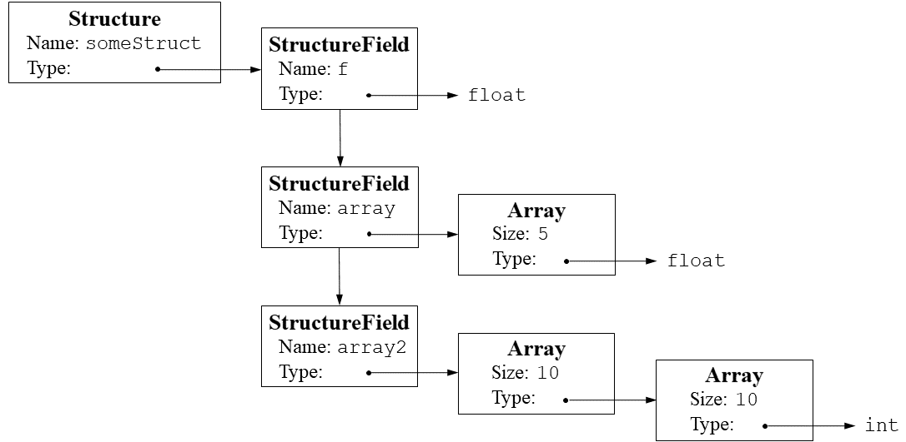

# compiler_c

course project of compiler principle


### Assignment

Xiao：词法分析(√)、语法分析（√），语法树可视化（√），生成中间代码与目标代码（√），宏函数替换 （√）expected ddl:5 24


Yu：生成中间代码与生成目标代码 （√）、报告撰写（）  expected ddl:5 29


测试点1：pass （`quick_sort` branch）:tested by Xiao

测试点2：pass （`matrix_multiply` branch）:tested by Xiao

测试点3:  to do by Yu


### Quick Start

1. `git pull` to make sure you're up to date
2. Optionally, `git checkout <your-branch-name>` (the **master** branch should always be working fine)
3. `make`  to compile and run the project.
4. `make test` to run the testing cases,`make clean` to clear the generation result.


#### Creating branches and commit

Use `git checkout -b <branch name>` to create a new branch for your specific module or a chunk of functionality development.

Feel free to create as many branches as you want, since this encourages cooperation.

There're a few guidelines you should follow when creating a new branch:

1. Every branch corresponds to a new functionality block, and should be created from its parent functionality (which should usually be the `master` branch). We maintain a functionaly master branch for you to create branches upon.
2. Every branch should have its name in a certain format as long as it's a functionality block.
   1. `feature/<feature name>` is for developing new stuff
   2. `fix/<problem name>` is for fixing existing problems
   3. `hotfix/<hotfix name>` is for fixing problems that needs immediate attention
3. Once you're done with your work from your own branch, that is, you've tested it on your own machine that the functionality, you can create a **Pull Request** at [GitHub](https://github.com/dendenxu/MediConnect-Front/pulls) from your branch to `master`, we'll deal with it by merging it or telling your to merge `master`into your branch first.


You should divide your work into specific, recognizable blocks of coding to make your commit clean and organized.

1. Every commit should at least **compile**.
2. Every commit message should follow some specific guidelines:
   1. `feat: <small feature name>` is for regular development
   2. `fix: <small problem name>` is for fixing some stuff that wasn't in consistency with your requirement specification
   3. `chore: <chore name>` is for doing some chore work that doesn't neccessarily affects the code, for example, adding comment
   4. `refactor: <what you've refactored>` is for refactoring the code to make it look like a poem that doesn't affect the final outcome of your code
   5. `merge: <from which to which>` is for administrators to merge branches
3. Generally, your commit message should sum up what you've done in this commit. And if you have anything interesting to let others know, write it in the `body` section of your commit message. We recommend a **SHORT and SELF-EXPLANATORY commit message header and DETAILTED commit message body.**


## Feature

### 文法定义部分

#### token

```
INT -> /* A sequence of digits without spaces1 */
FLOAT -> /* A real number consisting of digits and one decimal point. The decimal
point must be surrounded by at least one digit2 */
ID -> /* A character string consisting of 52 upper- or lower-case alphabetic,
10 numeric and one underscore characters. Besides, an identifier must not start
with a digit3 */
SEMI -> ;
COMMA -> ,
ASSIGNOP -> =
RELOP -> > | < | >= | <= | == | !=
PLUS -> +
MINUS -> -
STAR -> *
DIV -> /
AND -> &&
OR -> ||
DOT -> .
NOT -> !
TYPE -> int | float
LP -> (
RP -> )
LB -> [
RB -> ]
LC -> {
RC -> }
STRUCT -> struct
RETURN -> return
IF -> if
ELSE -> else
WHILE -> while
```

#### 生成文法：

```
Program -> ExtDefList
ExtDefList -> ExtDef ExtDefList
| null
ExtDef -> Specifier ExtDecList SEMI
| Specifier SEMI
| Specifier FunDec CompSt
ExtDecList -> VarDec
| VarDec COMMA ExtDecList

Specifier -> TYPE
| StructSpecifier
StructSpecifier -> STRUCT OptTag LC DefList RC
| STRUCT Tag
OptTag -> ID
| null
Tag -> ID

VarDec -> ID
| VarDec LB INT RB
FunDec -> ID LP VarList RP
| ID LP RP
VarList -> ParamDec COMMA VarList
| ParamDec
ParamDec -> Specifier VarDec

CompSt -> LC DefList StmtList RC
StmtList -> Stmt StmtList
| null
Stmt -> Exp SEMI
| CompSt
| RETURN Exp SEMI
| IF LP Exp RP Stmt
| IF LP Exp RP Stmt ELSE Stmt
| WHILE LP Exp RP Stmt

DefList -> Def DefList
| null
Def -> Specifier DecList SEMI
DecList -> Dec
| Dec COMMA DecList
Dec -> VarDec
| VarDec ASSIGNOP Exp

Exp -> Exp ASSIGNOP Exp
| Exp AND Exp
| Exp OR Exp
| Exp RELOP Exp
| Exp PLUS Exp
| Exp MINUS Exp
| Exp STAR Exp
| Exp DIV Exp
| LP Exp RP
| MINUS Exp
| NOT Exp
| ID LP Args RP
| ID LP RP
| Exp LB Exp RB
| Exp DOT ID
| ID
| INT
| FLOAT
Args -> Exp COMMA Args
| Exp
```

#### 符号表结构：

基于十字链表与open hashing散列表



#### 类型表示：

结构体的类型结构表示如下

