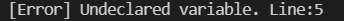
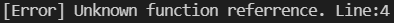

# compiler_c

course project of compiler principle


### Assignment

Xiao：词法分析(√)、语法分析（√），语法树可视化（√），生成中间代码与目标代码（√），宏函数替换 （√），循环优化（）测试程序1&2(√)  expected ddl:5 24


Yu：生成中间代码与生成目标代码 （√）、报告撰写（）测试程序3 (√)  expected ddl:5 29


测试点1：pass （`quick_sort` branch）:tested by Xiao

测试点2：pass （`matrix_multiply` branch）:tested by Xiao

测试点3:   pass  tested by Xiao

测试点全部通过.

完成的进阶主题：

（1）宏函数与宏替换、

（2）IR中间代码优化优化：循环向量化（Loop and SLP 向量化）、循环展开、常量折叠。。。。

（3）错误检测与提示

（两人组时间有限 预处理部分还在完成中555555）、


第2点实现方式：调库、预处理

循环优化：

（1）LLVM提供：调用llvm Pass对llvm-IR中间代码进行优化（eg:unroll and jam、DCE(dead code elimination)、EarlyCSE）

优化效果展示：

简单的循环优化（向量化、变量复用）：

```
int main(){
int unroll[1000];
int i;
i=0;
while(i<1000){
    unroll[i]=i;
    i=i+1;
}
i=0;
while(i<1000){
    unroll[i]= unroll[i]+10;
    i=i+1;
}
return 0;
}
```

优化前：


优化后：


同时调用多个不同的优化时：

优化前与优化之后对比：

程序占用空间：quick sort 测试程序

优化前：


优化后：


程序运行时间：auto adviser 测试程序

优化前：


优化后：


程序占用空间与消耗时间都得到了明显的优化（但有时候会牺牲空间换取时间，进一步研究中）。


（2）预处理优化（完成中）：

暂时只实现了最基本的无效表达式移除与while合并，其他优化还在开发中。


优化后：


常量传播与折叠：

```
int main(){
    int x;
    int y;
    int z;
    x=14;
    y=21;
    z=24;
    return 0;
}
```

优化前：


优化后：


**错误检测提示：**（还在加紧完善中，时间比较紧，不完善之处请谅解）

错误示例1：变量未声明

输入1：

```c
int main()
{
    int i；
    i= 0;
    j = i + 1;
}
```

输出：



错误示例：函数未声明

输入2：

```c
int main(){
int i；
i = 0;
add(i);
}
```

输出：


错误示例：变量重定义

输入3：

```c
int main()
{ int i;
  int i;
}
```

输出


错误示例：函数重定义

输入4：

```c
int func(int i)
{
	return i;
}
int func()
{
	return 0;
}
int main()
{

}
```

输出：


错误示例：变量类型错误

输入5：

```c
int main()
{
	int i;
	i = 1.1;
}
```

输出：


错误示例：输入格式错误

输入6：

```c
int main(){
    float a;
    a=.09;
return 0;
}
```

输出：


错误示例：函数参数个数错误

输入7：

```c
int func(int i)
{
return i;
 }

 int main()
 {
 func(1, 2);
 }int main()
{
int i;
 10 = i;
 }
```

输出


错误示例：非数组变量调用下标

输入8：

```c
int main()
{
int i;
i[0];
 }
```

输出：


错误示例：索引下标错误

输入9：

```c
int main()
{
int i[10];
i[1.5] = 10;
 }
```

输出


错误示例：不存在的函数

输入10：

```c
int main()
{
int i;
i(10);
}
```

输出：




复杂错误示例：变量重定义

输入11：

```c
int func()
{
int i;
i = 10;
return i;
}

int main()
{
 int i;
 int i;
 int j;
 i = func();
 return 0;
}
```

输出：


输入12：


错误类型to do:

关于局部变量与全局变量的区别等、错误恢复（语法级别与生成中间代码级别）


usage:

`make` to compile and `make clean` to clean the result of past.

`make draw` to generate the picture of syntax tree.(in `syntaxtree.png)`

you can also `./compile.sh` to finish all work of compiling and test.

`./submit1.sh` to test quicksort

`./submit1.sh` to test matrix multiplication

`./submit1.sh` to test auto_adviser

`./submitmacro.sh` to show the example of macro function

### Quick Start

1. `git pull` to make sure you're up to date
2. Optionally, `git checkout <your-branch-name>` (the **master** branch should always be working fine)
3. `make`  to compile and run the project.


#### Creating branches and commit

Use `git checkout -b <branch name>` to create a new branch for your specific module or a chunk of functionality development.

Feel free to create as many branches as you want, since this encourages cooperation.

There're a few guidelines you should follow when creating a new branch:

1. Every branch corresponds to a new functionality block, and should be created from its parent functionality (which should usually be the `master` branch). We maintain a functionaly master branch for you to create branches upon.
2. Every branch should have its name in a certain format as long as it's a functionality block.
   1. `feature/<feature name>` is for developing new stuff
   2. `fix/<problem name>` is for fixing existing problems
   3. `hotfix/<hotfix name>` is for fixing problems that needs immediate attention
3. Once you're done with your work from your own branch, that is, you've tested it on your own machine that the functionality, you can create a **Pull Request** at [GitHub](https://github.com/dendenxu/MediConnect-Front/pulls) from your branch to `master`, we'll deal with it by merging it or telling your to merge `master`into your branch first.


You should divide your work into specific, recognizable blocks of coding to make your commit clean and organized.

1. Every commit should at least **compile**.
2. Every commit message should follow some specific guidelines:
   1. `feat: <small feature name>` is for regular development
   2. `fix: <small problem name>` is for fixing some stuff that wasn't in consistency with your requirement specification
   3. `chore: <chore name>` is for doing some chore work that doesn't neccessarily affects the code, for example, adding comment
   4. `refactor: <what you've refactored>` is for refactoring the code to make it look like a poem that doesn't affect the final outcome of your code
   5. `merge: <from which to which>` is for administrators to merge branches
3. Generally, your commit message should sum up what you've done in this commit. And if you have anything interesting to let others know, write it in the `body` section of your commit message. We recommend a **SHORT and SELF-EXPLANATORY commit message header and DETAILTED commit message body.**


## Feature

### 文法定义部分

#### token

```
INT -> /* A sequence of digits without spaces1 */
FLOAT -> /* A real number consisting of digits and one decimal point. The decimal
point must be surrounded by at least one digit2 */
ID -> /* A character string consisting of 52 upper- or lower-case alphabetic,
10 numeric and one underscore characters. Besides, an identifier must not start
with a digit3 */
SEMI -> ;
COMMA -> ,
ASSIGNOP -> =
RELOP -> > | < | >= | <= | == | !=
PLUS -> +
MINUS -> -
STAR -> *
DIV -> /
AND -> &&
OR -> ||
DOT -> .
NOT -> !
TYPE -> int | float
LP -> (
RP -> )
LB -> [
RB -> ]
LC -> {
RC -> }
STRUCT -> struct
RETURN -> return
IF -> if
ELSE -> else
WHILE -> while
```

#### 生成文法：

```
Program -> ExtDefList
ExtDefList -> ExtDef ExtDefList
| null
ExtDef -> Specifier ExtDecList SEMI
| Specifier SEMI
| Specifier FunDec CompSt
ExtDecList -> VarDec
| VarDec COMMA ExtDecList

Specifier -> TYPE
| StructSpecifier
StructSpecifier -> STRUCT OptTag LC DefList RC
| STRUCT Tag
OptTag -> ID
| null
Tag -> ID

VarDec -> ID
| VarDec LB INT RB
FunDec -> ID LP VarList RP
| ID LP RP
VarList -> ParamDec COMMA VarList
| ParamDec
ParamDec -> Specifier VarDec

CompSt -> LC DefList StmtList RC
StmtList -> Stmt StmtList
| null
Stmt -> Exp SEMI
| CompSt
| RETURN Exp SEMI
| IF LP Exp RP Stmt
| IF LP Exp RP Stmt ELSE Stmt
| WHILE LP Exp RP Stmt

DefList -> Def DefList
| null
Def -> Specifier DecList SEMI
DecList -> Dec
| Dec COMMA DecList
Dec -> VarDec
| VarDec ASSIGNOP Exp

Exp -> Exp ASSIGNOP Exp
| Exp AND Exp
| Exp OR Exp
| Exp RELOP Exp
| Exp PLUS Exp
| Exp MINUS Exp
| Exp STAR Exp
| Exp DIV Exp
| LP Exp RP
| MINUS Exp
| NOT Exp
| ID LP Args RP
| ID LP RP
| Exp LB Exp RB
| Exp DOT ID
| ID
| INT
| FLOAT
Args -> Exp COMMA Args
| Exp
```


##### 语法树结构：

child----sibling的多叉树结构

**可视化**：graphviz


##### 中间代码生成：

调用llvm生成llvm中间代码


##### 目标代码生成：

clang

